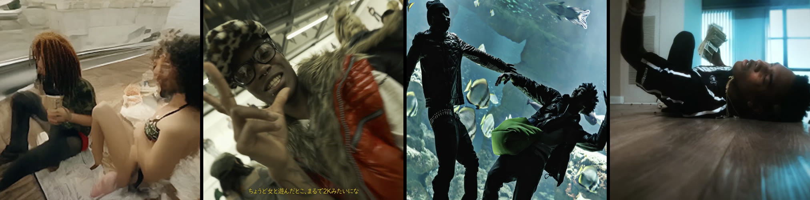
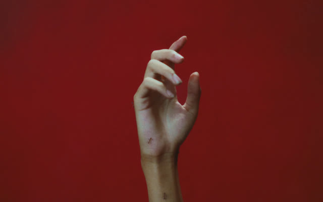
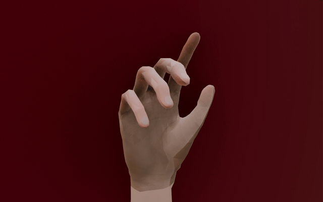
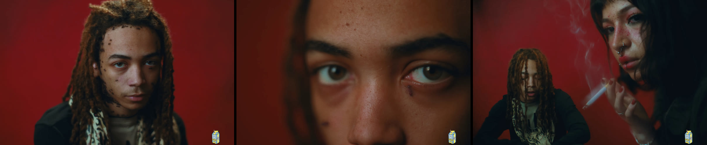

---

### About

Computer Science student at McGill University, based in Montreal. I have a passion for building and for learning new, powerful concepts and tools.

---

### Tech Stack

  

plus some assembly when things get low level

---

### Projects

**Pleco** - Commercialized SaaS for digital loyalty programs (points or stamps) living in the Apple and Google wallet, serving 7000+ end users. A Kafka based pipeline delivers 7000+ server expensive pass notifications in sub-minute time. Revenue generating, sold door to door to small businesses. NestJS, Redis, Kafka, Docker, PostgreSQL.

**[Interview Getter](https://github.com/Achraf921/interview-getter-releases)** - Desktop app that automates LinkedIn outreach so you get interviews instead of ghosted applications. Captured 1M+ views on social media. Electron + TypeScript.

**Lads Events** - Events centered social media mobile app with 500+ App Store downloads. Stripe and Apple Pay payments with idempotency enforcement, image moderation through AWS Rekognition. ExpressJS, PostgreSQL, Prisma, AWS.

**[twineconvert](https://github.com/Achraf921/twineconvert)** - 192 file converters across 28 format families, running entirely in your browser. No uploads, unlike CloudConvert and friends.

---

### GitHub Stats

<!-- 3D Contribution Graph - requires GitHub Action setup -->

  

<!-- Snake Animation - requires GitHub Action setup -->

<picture>
  <source media="(prefers-color-scheme: dark)" srcset="https://raw.githubusercontent.com/Achraf921/Achraf921/output/github-snake-dark.svg" />
  <source media="(prefers-color-scheme: light)" srcset="https://raw.githubusercontent.com/Achraf921/Achraf921/output/github-snake.svg" />
  
</picture>

---

### Education

**B.Sc. Honours Computer Science, Minor in Statistics** - McGill University, Montreal (2024-2027)

**French Baccalauréat** - Lycée Privé Montalembert - Specialities: Mathematics, Physics, Chemistry

---

### Languages

English · French · Darija

---

Also into music, art, fashion, history and sports...

 

**Music.** I'll listen to just about anything good: mainstream rap, afrobeats, rumba, bachata, and a lot in between. Where I keep ending up though is underground and more experimental rap. The rotation changes every month, but right now it's Che, Nine Vicious, Glokk40Spazz and 63kluff. The videos are half the appeal, every one is its own little world:

  

Che · Nine Vicious · 63kluff · Glokk40Spazz

**Art.** The aesthetic of Che's <a href="https://youtu.be/dm_CO-OUChs">I ROT</a> video (directed by Cole Bennett) was particularly appealing to me, so I tried animating it myself in Blender, in a triangulated, GTA San Andreas kind of style. Cole Bennett's frame on the left, mine on the right:

  
  

  

more frames from I ROT

