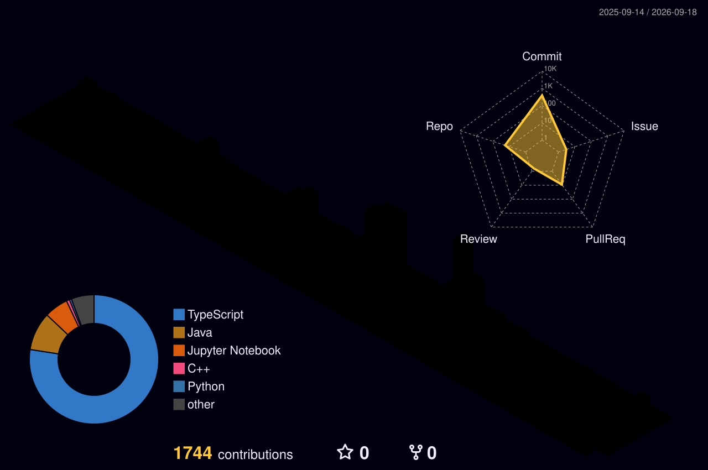

---

### About

Computer Science student at McGill University, based in Montreal. I have a passion for building and for learning new, powerful concepts and tools.

---

### Tech Stack

  

plus some assembly when things get low level

---

### Projects

**[Interview Getter](https://github.com/Achraf921/interview-getter-releases)** - Desktop app that automates LinkedIn outreach so you get interviews instead of ghosted applications. Electron + TypeScript.

**[Sua](https://github.com/Achraf921/sua-claude-hackathon)** - Bet on underground artists before they blow up. Real SOL on pump.fun bonding curves, with a Claude-powered AI scout. Built solo in one day at the Claude Builders Hackathon at McGill.

**[twineconvert](https://github.com/Achraf921/twineconvert)** - 192 file converters across 28 format families, running entirely in your browser. No uploads, unlike CloudConvert and friends.

**[SNA GZ platform](https://snagz-app.com)** - Enterprise SaaS for automated Shopify store creation and management. React, Node.js, MongoDB Atlas, AWS.

---

### GitHub Stats

<!-- 3D Contribution Graph - requires GitHub Action setup -->

  

<!-- Snake Animation - requires GitHub Action setup -->

<picture>
  <source media="(prefers-color-scheme: dark)" srcset="https://raw.githubusercontent.com/Achraf921/Achraf921/output/github-snake-dark.svg" />
  <source media="(prefers-color-scheme: light)" srcset="https://raw.githubusercontent.com/Achraf921/Achraf921/output/github-snake.svg" />
  
</picture>

---

### Education

**B.Sc. Computer Science** - McGill University, Montreal (2024-2027)

**French Baccalauréat** - Lycée Privé Montalembert - Specialities: Mathematics, Physics, Chemistry

---

### Languages

English · French · Darija

---

Also into music, fashion, history and sports.

